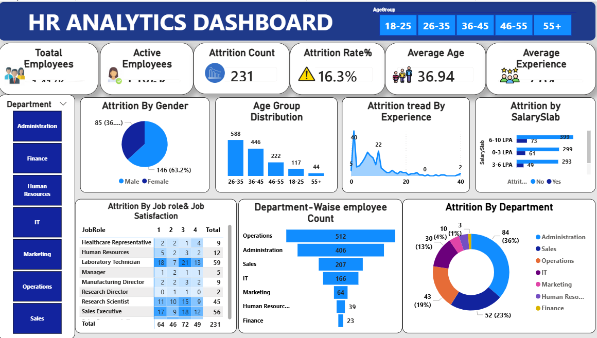

# 📊 HR Analytics Dashboard | Power BI

## 📌 Project Overview

An interactive **HR Analytics Dashboard** built using **Microsoft Power BI** to analyze employee attrition, workforce distribution, demographics, departments, job roles, salary levels, and employee experience.

The objective of this project is to transform HR data into meaningful visual insights that can help HR teams understand **employee attrition patterns and workforce trends** and support data-driven decision-making.

---

## 🎯 Business Problem

Employee attrition can increase recruitment costs, training requirements, and productivity loss. HR teams need a clear view of employee data to identify areas where attrition may require further investigation.

This dashboard helps answer questions such as:

- What is the total and active employee count?
- What is the overall attrition rate?
- Which departments have higher employee attrition?
- Which job roles have higher attrition?
- How does attrition vary by age and gender?
- How does attrition vary across salary levels?
- How does employee experience relate to attrition?

---

## 📊 Key KPIs

- Total Employees
- Active Employees
- Attrition Count
- Attrition Rate
- Average Age
- Average Experience

---

## 🔍 Analysis Performed

- **Attrition Analysis** – Overall employee turnover and attrition rate
- **Department Analysis** – Employee count and attrition by department
- **Job Role Analysis** – Attrition across different job roles
- **Gender Analysis** – Attrition comparison by gender
- **Age Group Analysis** – Workforce and attrition across age groups
- **Salary Analysis** – Attrition across salary slabs
- **Experience Analysis** – Attrition patterns based on employee experience

---

## 🛠️ Tools & Technologies

- **Microsoft Power BI** – Dashboard development and data visualization
- **Power Query** – Data cleaning and transformation
- **DAX** – Measures and KPI calculations
- **Data Modeling** – Preparing data for analysis
- **Data Visualization** – Interactive charts, filters, and KPI cards

---

## 🧠 Skills Demonstrated

- Data Cleaning & Transformation
- Data Modeling
- DAX
- KPI Development
- Exploratory Data Analysis
- Data Visualization
- Business Intelligence
- HR Analytics
- Dashboard Design
- Business Problem Solving
- Data Storytelling

---

## 📈 Dashboard Features

- Interactive KPI cards
- Department filters
- Age group filters
- Attrition by gender
- Attrition by salary slab
- Attrition by job role
- Attrition by experience
- Department-wise employee analysis
- Interactive charts and visualizations

---

## 💡 Business Value

The dashboard provides a centralized and interactive view of HR data, helping users quickly identify **employee attrition patterns, workforce distribution, and employee segments that may require further investigation**.

It demonstrates how Power BI can be used to convert raw HR data into **actionable business insights**.

---

## 📷 Dashboard Preview

---

## 📁 Project Files

| File | Description |
|------|-------------|
| `HR Analytics Dashboard.pbix` | Power BI dashboard file |
| `dashboard.png` | Dashboard preview |
| `README.md` | Project documentation |

---

## 🚀 Project Outcome

This project demonstrates practical experience with **Power BI, DAX, Power Query, data modeling, data visualization, and business analytics** by solving an HR-focused data analysis problem.

---

## 👨‍💻 Author

**Prince Yadav**

B.Tech CSE | Aspiring Data Analyst

**Skills:** SQL • Power BI • Excel • Python • MySQL

## screenshots / Demos
show what the dashboard looks like. - 
Example :

